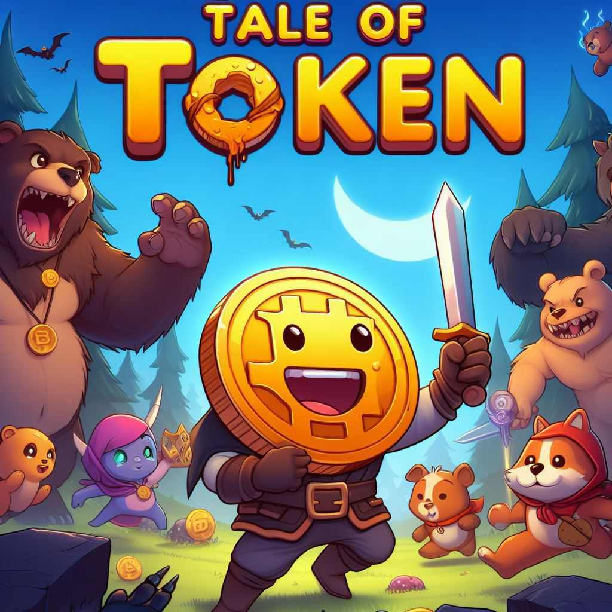

  

# Tale of Token - "L'histoire d'un jeton'"

Entrez dans un monde fantastique où chaque joueur incarne une pièce de monnaie numérique. La mission ? Combattre des monstres, progresser dans une histoire captivante et obtenir des équipements toujours plus puissants. Ce monde est truffé de références à la culture de la crypto-monnaie. Au fil de l'aventure, chaque joueur pourra choisir sa voie parmi de multiples classes et compétences, affronter de nombreux adversaires et même défier d'autres joueurs en PvP.

## Objectifs du jeu

- Monter en niveau pour obtenir des équipements plus puissants et des compétences plus efficaces.
- Progresser dans l'histoire principale.
- Défier les autres joueurs en PvP.
- Surpasser les autres joueurs dans des classements.
- Créer une guilde et la faire prospérer.
- Participer à des événements spéciaux.
- Collectionner des compagnons et des équipements rares.
- Débloquer des succès.
- Compléter des quêtes journalières.
- Participer à des donjons, des raids, des guerres de guildes, des tournois et des événements spéciaux.
- Participer à des événements saisonniers (Halloween, Noël, Pâques, Saint Valentin, etc.).

## Gameplay

### Ouverture d'un crypto-coffre

En échange d'une clé, un équipement de rareté aléatoire est obtenu. Cet équipement peut soit être équipé pour améliorer les statistiques, soit être vendu pour obtenir de l'XP et des pièces.

### Monter en niveau

Chaque niveau nécessite une certaine quantité d'XP. De l'XP peut être obtenue en vendant un équipement obtenu dans le crypto-coffre. Chaque objet vendu rapporte un certain nombre d'XP en fonction de sa rareté. Chaque niveau passé augmente les attributs principaux de 10%.

### Gain hors ligne

Même lorsqu'un joueur est déconnecté, des pièces d'or, des compagnons, des compétences et des clés de crypto-coffre continuent à être gagnés. Les récompenses sont stockées dans une file d'attente et sont distribuées lors de la connexion et du clic sur un petit bouton portefeuille. La période de récolte est de 8 h au maximum.

### Avancée dans l'aventure

Le combat est continu. L'aventure est séparée en 10 chapitres et chaque chapitre possède plusieurs niveaux. À la fin de chaque chapitre, il y a un boss. Les monstres sont combattus grâce aux compétences. Les compétences font plus ou moins de dégâts en fonction des statistiques, qui sont améliorées par les équipements.

### Le joueur

En tant que joueur, des statistiques principales (niveau, expérience), des attributs principaux (PV, ATQ, VIT, DEF) et des attributs secondaires (coup critique, étourdissement, évasion, regen vie, dégâts critiques, coup critique de compétence, dégâts critiques de compétence, bonus d'ATQ, bonus de DEF, bonus de VIT, bonus de PV) sont disponibles.

### Compétences de joueur

En augmentant de niveau, des compétences de joueur sont obtenues. Les compétences sont obtenues en montant de niveau, et diffèrent en fonction de la classe. Une compétence active et 5 passives sont disponibles. Au fur et à mesure de l'avancée dans l'aventure, la classe peut être changée et donc les compétences.

### Classes de personnages

Dans ce jeu, les joueurs commencent leur aventure en tant que "Token Vagabond", une classe de base commune à tous. À ce stade, ils disposent d'une compétence active, le "Coup de poing", qui leur permet d'infliger des dégâts physiques à leurs ennemis.

Au niveau 10, les joueurs ont la possibilité de choisir parmi trois classes : Archer, Mage et Guerrier. Chaque classe offre une nouvelle compétence passive unique qui est débloquée lors de la sélection de la classe.

1. **Archer** : Cette classe se concentre sur l'attaque à distance. Les archers ont une compétence active "Tir à l'arc" qui inflige des dégâts à un ennemi avec une flèche précise. Au fur et à mesure de leur progression, ils peuvent évoluer en "Ranger" puis en "Tireur d'élite", débloquant des compétences passives qui augmentent leur vitesse d'attaque et leurs chances de coups critiques à distance.

2. **Mage** : Les mages sont des maîtres des arts magiques. Leur compétence active, "Boule de feu", leur permet de lancer une boule de feu en direction d'un ennemi, infligeant des dégâts magiques. En progressant, ils peuvent devenir "Sorcier" puis "Archimage", débloquant des compétences passives qui augmentent les dégâts de leurs compétences et leurs chances de coups critiques.

3. **Guerrier** : Les guerriers sont des combattants au corps à corps robustes. Leur compétence active, "Coup d'épée", leur permet d'infliger des dégâts à un ennemi avec une attaque puissante. En progressant, ils peuvent évoluer en "Paladin" puis en "Seigneur de guerre", débloquant des compétences passives qui augmentent leur attaque et réduisent les dégâts subis lorsque leur santé est basse.

Chaque classe offre une expérience de jeu unique et permet aux joueurs de choisir le style de jeu qui leur convient le mieux.

### Cryptomons

Les compagnons, surnommés "cryptomon", combattent à vos côtés. Plusieurs peuvent être possédés mais seuls 5 peuvent être actifs à la fois. Chaque cryptomon possède des statistiques qui améliorent celles du joueur. Les cryptomons peuvent être améliorés en les fusionnant avec d'autres compagnons. Les cryptomons peuvent être équipés d'équipements pour améliorer leurs statistiques.

### Donjons

Des créatures uniques comme Marc the bear, Runny the bull et Monkey the trader peuvent être affrontées pour obtenir des récompenses spéciales.

## Stack technique

Ce jeu utilise une stack technique moderne et robuste, incluant Firestore pour la base de données, Cloud Functions pour les calculs côté serveur et les triggers, Angular pour le front-end, couplé au framework Phaser pour les animations, et Firebase pour l'authentification, le stockage des fichiers, les notifications, les analytics, les crashlytics, les performances, le remote config, le test lab, le A/B testing et le hosting.

## Monétisation

Plusieurs options sont offertes pour améliorer l'expérience de jeu et aider les joueurs à progresser plus rapidement, y compris des achats intégrés, des publicités, des abonnements, des ventes de cosmétiques, des packs de progression, des ventes d'équipements et des événements payants. De plus, ce jeu a sa propre crypto-monnaie, le TOT (TOT), qui peut être utilisée pour acheter des objets exclusifs, des avantages spéciaux ou des récompenses uniques dans le jeu.

## Features

Ce jeu est en constante évolution. Une version 1.0 / POC avec des fonctionnalités de base est prévue, puis de nouvelles fonctionnalités seront ajoutées dans la version 2.0, comme l'obtention des compétences et la création des cryptomons.

Découvrez le monde de Tale of Token et rejoignez cette aventure passionnante !
