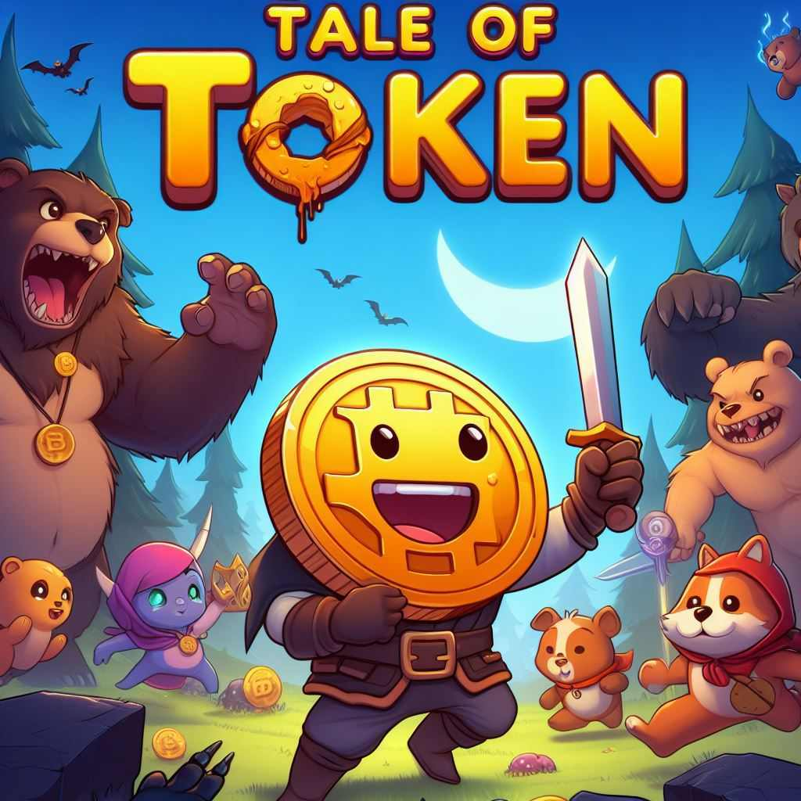
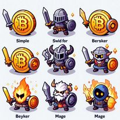

  

Tale of Token - "L'histoire d'un jeton'"
=================

Le joueur évolue dans un monde fantastique où il incarne une piece de monnaie numérique qui doit combattre des monstres pour progresser dans l'histoire principale et obtenir des équipements de plus en plus puissants.
Ce monde comprend de multiples références à la culture crypto-monnaie. Au file de son aventure le joueur pourra chosir sa voie via de multiples classes et compétences, il aura a affronter de nombreux adversaires et pourra même défier d'autres joueurs en pvp.

# Principes
Les buts du jeux sont multiples,:

- Monter en niveau pour obtenir des équipements plus puissants et des compétences plus efficaces pour combattre des monstres de plus en plus puissants.
- Progresser dans l'histoire principale.
- Défier les autres joueurs en pvp
- Surpasser les autres joueurs dans des classements
- Créer une guilde et la faire prospérer
- Participer à des événements spéciaux
- Collectionner des compagnons et des équipements rares
- Débloquer des succès
- Compléter des quêtes journalières
- Participer à des donjons
- Participer à des raids
- Participer à des guerres de guildes
- Participer à des tournois
- Participer à des événements spéciaux

- Participer à des événements saisonniers
    - Halloween, Noël, Pâques, Saint Valentin, etc.

# Gameplay :

### Ouverture d'un crypto-coffre : En echange d'une clé, le joueur obtient un équipement de rareté aléatoire.
Deux choix s'offrent à lui :

- Equiper l'équipement pour améliorer ses statistiques
- Vendre l'équipement pour obtenir de l'xp et des pieces

## Monter en niveau

Chaque niveau necessite une quantité d'xp pour être passé.
L'xp s'obtient en vendant un equipement obtenu dans le crypto-coffre.
Chaque objet vendu rapport un certain nombre d'xp en fonction de sa rareté.
Chaque niveau passé augmente les Attributs principaux du joueur de 10%.

| Niveau | XP nécessaire |
|--------|---------------|
| 1-10   | 100 XP        |
| 11-20  | 200 XP        |
| 21-23  | 300 XP        |
| 24-26  | 500 XP        |
| 27-29  | 700 XP        |
| 30-32  | 1000 XP       |
| 33-35  | 1500 XP       |
| 36-38  | 2000 XP       |
| 39-40  | 3000 XP       |

## Crypto-coffre 

Ci dessous les probabilités d'obtention des différentes raretés d'équipements dans le crypto-coffres :

| Niveau du coffre | Basique (⚪ Blanc) | Commun (🟢 Vert) | Rare (🔵 Bleu) | Épique (🟣 Violet) | Légendaire (🟠 Orange) | Mythique (🔴 Rouge) | Cosmique (⚫ Noir) |
|------------------|-------------------|------------------|----------------|--------------------|------------------------|---------------------|-------------------|
| 1                | 80% / 5 XP        | 20% / 10 XP      | -              | -                  | -                      | -                   | -                 |
| 2                | 80% / 10 XP       | 20% / 15 XP      | -              | -                  | -                      | -                   | -                 |
| 3                | 80% / 15 XP       | 20% / 20 XP      | -              | -                  | -                      | -                   | -                 |
| 4                | 80% / 20 XP       | 20% / 25 XP      | -              | -                  | -                      | -                   | -                 |
| 5                | 75% / 25 XP       | 23% / 30 XP      | 2% / 35 XP     | -                  | -                      | -                   | -                 |
| 6                | 70% / 30 XP       | 25% / 35 XP      | 4% / 40 XP     | 1% / 45 XP         | -                      | -                   | -                 |
| 7                | 65% / 35 XP       | 28% / 40 XP      | 5% / 45 XP     | 2% / 50 XP         | -                      | -                   | -                 |
| 8                | 60% / 40 XP       | 30% / 45 XP      | 7% / 50 XP     | 3% / 55 XP         | -                      | -                   | -                 |
| 9                | 55% / 45 XP       | 32% / 50 XP      | 9% / 55 XP     | 4% / 60 XP         | -                      | -                   | -                 |
| 10               | 50% / 50 XP       | 34% / 55 XP      | 11% / 60 XP    | 5% / 65 XP         | -                      | -                   | -                 |
| ...              | ...               | ...              | ...            | ...                | ...                    | ...                 | ...               |
| 40               | 20% / 200 XP      | -                | 18% / 650 XP   | 80% / 900 XP       | 1% / 2000 XP           | 0.95 / 5000 XP      | 0.05 / 10000 XP   |

## Gain hors ligne :

En etant déconnecté, gain de :
- Pieces d'or
- Compagnons
- Compétences
- Clé de crypto coffre

Au niveau 1 : 

30 pièces d'or par minutes 
1 compagnon par heure
1 compétence par heure
10 clé de crypto-coffre par heure

Les récompenses augmentent de 10% par niveau.
Les récompenses sont stockées dans une file d'attente et sont distribuées 
au joueur lorsqu'il se connecte et qu'il clique sur un petit bouton portefeuille.
La période de récolte est de 8 h au maximum.

## Avancée dans l'aventure :

Le joueur combat continuellement. L'aventure est séparée en 10 chapitres et chaque chapitre possède plusieurs niveaux.
A la fin de chaque chapitre, il y a un boss. 
Je joueur combat les monstres grâce à ses compétences.
Les compétences font plus ou moins de dégats en fonction des statistiques du joueur qui sont améliorées par les équipements.

## Le joueur :

### Statistiques principales

- Niveau : niveau du joueur
- Expérience : expérience du joueur

### Attributs principaux

- PV - Points de vie : points de vie du joueur
- ATQ - Attaque : attaque du joueur
- VIT - Vitesse d'attaque : vitesse d'attaque du joueur
- DEF - Defense : defense du joueur 

### Attributs secondaires

- coup critique : chance de faire un coup critique
- etoudissement : chance d'étourdir l'ennemi
- evasion : chance d'éviter un coup
- regen vie : regen vie par seconde
- degats critiques : multiplicateur de dégats critiques
- coup critique de compétence : chance de faire un coup critique avec une compétence
- dégats critiques de compétence : multiplicateur de dégats critiques avec une compétence
- bonus d'ATQ : bonus d'attaque
- bonus de DEF : bonus de defense
- bonus de VIT : bonus de vitesse d'attaque
- bonus de PV : bonus de points de vie

### Compétences de joueur :

Le joueur en augmentant de niveau obtient des compétences de joueur.
Les compétences sont obtenues en montant de niveau, et diffèrent en fonction de la classe du joueur.
Le joueur a une compétence active et 5 passives. 
Au fur et à mesure de l'avancée dans l'aventure, le joueur peut changer de classe et donc de compétences.
Les classes qu'il peut choisir sont dans la même ligné que la classe de départ, par éxemple un guerrier peut devenir un paladin ou un berserker, puis un roi guerrier ou un templier...

#### Classes : 

Les classes sont organisées en 3 branches, une première commune a tous au début, puis au niveau 10 le joueur fait un choix 3 classes Archer, Mage, Guerrier.
Une nouvelle compétence passive est débloquée à chaque nouvelle classe choisie dans la branche.

- Début de branche commun : Token vagabond : 
  - Niveau : 1
  - Compétence active : Coup de poing : Assène un coup de poing à un ennemi, infligeant des dégâts physiques.
  - Compétence passive : 
    - Pas de compétence passive

- Branche token archer : 
  - Compétence active : Tir à l'arc :  Inflige des dégâts à un ennemi avec une flèche précise.
  - Evolution de branche :
    - Niveau : 10
      - Nom classe : Archer
      - Compétence passive : 
        - Rapidité d'action / Augmente la vitesse d'attaque de 25%.
      - Niveau : 50
      - Nom classe : Ranger
      - Compétences passives : 
        - Précision mortelle / Augmente l'attaque à distance de 40% sur les cibles à distance.
      - Niveau : 100
      - Nom classe : Tireur d'élite
      - Compétences passives : 
        - Œil de l'aigle / Chance de coups critique à distance augmentée de 70 % toutes les trois attaques.
     
- Branche token mage : 
  - Compétence active : Boule de feu /  Lance une boule de feu en direction d'un ennemi, infligeant des dégâts magiques.
  - Evolution de branche :
    - Niveau : 10
      - Nom classe : Mage
      - compétence passive : 
        - Maitrise sacrée / Augmente les dégats des compétences de 15%
    - Niveau : 50
    - Nom classe : Sorcier
      - Compétence passive : 
        - Savoir arcanique / Augmente les dégâts des compétences de 15% et les chances de coup critique de 10%.
    - Niveau : 100
    - Nom classe : Archimage
      - Compétence passive : 
        - Furie magique / Augmente les dégâts dégats critiques de 20 % et les chances de coup critique de 10 % sur les adversaires de moins de 30 % de PV;

- Branche token guerrier : 
    - Compétence active : Coup d'épée : Inflige des dégâts à un ennemi avec une attaque puissante.
    - Evolution de branche :
      - Niveau : 10
        - Nom classe : Guerrier
        - compétence passive : 
          - Force de l'ours / Augmente l'attaque de 25%.
      - Niveau : 50
        - Nom classe : Paladin
        - compétence passive : 
          - Protection divine /  Réduit les dégâts subis de 20% lorsque la santé du joueur est en dessous de 30%.
      - Niveau : 100
        - Nom classe : Seigneur de guerre
        - compétence passive : 
          - Furie indomptable / Augmente l'attaque de 30% et la vitesse d'attaque de 20% lorsque la santé du joueur est en dessous de 30%.

### Compétences équipables :

Le joueur obtient des compétences en les achetant dans la boutique ou en les obtenant dans les crypto-coffres.
Il peut en équiper 5 à la fois.
Les compétences ont un temps de recharge.
Les compétences ont différents éffets : 
- Dégats
    - Dégats de zone
    - Dégats sur la durée
- Soins
  - Régénération de points de vie
  - Régénération de points de vie sur la durée
- Etourdissement
    - Etourdissement de zone
    - Etourdissement sur la durée
    - Etourdissement de compétence
- Buff
  - Augmentation de l'attaque
  - Augmentation de la defense
  - Augmentation de la vitesse d'attaque

- Debuff
  - Réduction de l'attaque
  - Réduction de la defense
  - Réduction de la vitesse d'attaque

    
### Cryptomons:

Les compagnons, surnommés "cryptomon" combattent au coté du joueur. Il peut en possèder plusieurs mais ne peu en avoir que 5 actif à la fois.
Chaque cryptomon possède des statistiques qui améliorent celles du joueur.
Les cryptomons peuvent être améliorés en les fusionnant avec d'autres compagnons.
Les cryptomons peuvent être équipés d'équipements pour améliorer leurs statistiques.

Chaque cryptomon possède les caracteristiques suivantes :

- Coefficient de dégats qui induit les dégats du compagnon, en fonction des statistiques du joueur. Exemple : 5.65
- Vitesse d'ataque qui induit la fréquence d'attaque du compagnon, exemple : 0.5 attaque par seconde.
- Effet de déploiement : effet appliqué losque le compagnon est actif.
  - Augmentation de x % de la statistique "coup critique"
  - Augmentation de x % de la statistique "etourdissement"
  - Augmentation de x % de la statistique "evasion"
  - Augmentation de x % de la statistique "regen vie"
  - Augmentation de x % de la statistique "degats critiques"
  - Augmentation de x % de la statistique "coup critique de compétence"
  - Augmentation de x % de la statistique "dégats critiques de compétence"
- Effet bonus : effet appliqué lorsque le compagnon est équipé. Les effets possibles : 
  - Augmentation de x % de la statistique "ATQ"
  - Augmentation de x % de la statistique "DEF"
  - Augmentation de x % de la statistique "VIT"
  - Augmentation de x % de la statistique "PV"

Les cryptomons peuvent être obtenus dans les crypto-coffres, dans la boutique ou en les achetant directement.
Le joueur possède une cryptoball qui lui permet de capturer des cryptomons sauvages.
Cette crypto ball a un niveau qui augmente plus le joueur capture de cryptomons.
Plus le niveau de la cryptoball est élevé, plus les cryptomons capturés sont rares.

Les cryptomons ont différents niveau de rareté : 

| Niveau Cryptoball | Nombre de captures nécessaires | Commun (🟢 Vert) | Rare (🔵 Bleu) | Épique (🟣 Violet) | Légendaire (🟠 Orange) |
|-------------------|--------------------------------|------------------|----------------|--------------------|------------------------|
| 1                 | 5                              | 80%              | -              | -                  | -                      |
| 2                 | 10                             | 80%              | -              | -                  | -                      |
| 3                 | 15                             | 80%              | -              | -                  | -                      |
| 4                 | 20                             | 80%              | -              | -                  | -                      |
| 5                 | 25                             | 75%              | 2%             | -                  | -                      |
| 6                 | 30                             | 70%              | 4%             | 1%                 | -                      |
| 7                 | 35                             | 65%              | 5%             | 2%                 | -                      |
| 8                 | 40                             | 60%              | 7%             | 3%                 | -                      |
| 9                 | 45                             | 55%              | 9%             | 4%                 | -                      |
| 10                | 50                             | 50%              | 11%            | 5%                 | -                      |
| 11                | 55                             | 45%              | 13%            | 6%                 | -                      |
| 12                | 60                             | 40%              | 15%            | 7%                 | -                      |
| 13                | 65                             | 35%              | 17%            | 8%                 | -                      |
| 14                | 70                             | 30%              | 19%            | 9%                 | -                      |
| 15                | 75                             | 25%              | 21%            | 10%                | -                      |
| 16                | 80                             | 25%              | 21%            | 10%                | -                      |
| 17                | 85                             | 25%              | 21%            | 10%                | -                      |
| 18                | 90                             | 25%              | 21%            | 10%                | -                      |
| 19                | 95                             | 25%              | 21%            | 10%                | -                      |
| 20                | 100                            | 25%              | 21%            | 10%                | -                      |

Les cryptomons de rareté légendaire s'obtiennent uniquement en fusionnant certains cryptomons de rareté épique, en plusieurs
exemplaires.

## Donjons :

Marc the bear :

Un ours que l'on peut défier plusieurs fois par jours.
Pour le vaincre, il faut posseder un pot de miel et attendre que le combat se termine.
Si victoire : en fonction du niveau de l'ours, un nombre aléatoire de clé à crypto-coffre .
Si défaite : rien, on peu rééssayer autant de fois que l'on veut.

Runny the bull :
Un taureau que l'on peut défier plusieurs fois par jours.
Pour le vaincre, il faut posseder un ticket rouge FOMO et attendre que le combat se termine.
Si victoire : en fonction du niveau du taureau, A définir.
Si défaite : rien, on peu rééssayer autant de fois que l'on veut.

TODO : A définir
Monkey the trader : 

Un singe que l'on peut défier plusieurs fois par jours.
TODO : A définir

# Détails graphiques :

## Interface utilisateur :
  
## Personnages :

  

- Token vagabond
- Archer
- Mage
- Guerrier
- Ranger
- Sorcier
- Paladin
- Archimage
- Tireur d'élite
- Seigneur de guerre

## Cryptomons :

### Commun (🟢 Vert) :
### Rare (🔵 Bleu) :
### Épique (🟣 Violet) :
### Légendaire (🟠 Orange) :
### Mythique (🔴 Rouge) :
### Cosmique (⚫ Noir) :

# Stack technique :

- firestore pour la base de données
- cloud functions pour les calculs coté serveurs et les triggers
- Angular pour le front-end, couplé au framwork phaser pour les animations
- Firebase pour l'authentification
- Firebase pour le stockage des fichiers
- Firebase pour les notifications
- Firebase pour les analytics
- Firebase pour les crashlytics
- Firebase pour les performances
- Firebase pour le remote config
- Firebase pour le test lab
- Firebase pour le A/B testing
- Firebase pour le hosting

# Monétisation

## Classique 

Dans notre jeu, nous offrons plusieurs options pour améliorer l'expérience de jeu et aider les joueurs à progresser plus rapidement.

1. **Achats intégrés** : Les joueurs ont la possibilité d'acquérir des clés de coffre supplémentaires, des équipements spéciaux, des compagnons exclusifs ou des avantages temporaires pour faciliter leur progression.

2. **Publicités** : Nous proposons des publicités vidéo optionnelles qui permettent aux joueurs de gagner des récompenses en jeu, comme des pièces d'or supplémentaires ou des clés de coffre.

3. **Abonnements** : Nous proposons des abonnements premium qui offrent des avantages exclusifs, tels que des réductions sur les achats en jeu, des bonus d'XP, des cosmétiques spéciaux ou un accès anticipé à de nouveaux contenus.

4. **Ventes de cosmétiques** : Les joueurs peuvent personnaliser l'apparence de leur personnage, de leurs compagnons ou de leur guilde en achetant des cosmétiques, sans affecter le gameplay.

5. **Packs de progression** : Nous proposons des packs de progression qui offrent aux joueurs un coup de pouce dans leur progression, comme des boosts d'XP, des coffres supplémentaires, ou des équipements exclusifs.

6. **Ventes d'équipements** : Les joueurs ont la possibilité d'acheter directement des équipements puissants, des cryptomons rares ou des objets spéciaux pour les aider dans leur aventure.

7. **Événements payants** : Nous organisons régulièrement des événements spéciaux accessibles uniquement aux joueurs ayant acheté un ticket d'entrée, offrant des récompenses uniques et des défis exclusifs.
## Crypto-monnaie

L'application aurait sa propre crypto-monnaie, le TOT (TOT), qui pourrait être utilisée pour acheter des objets exclusifs, des avantages spéciaux ou des récompenses uniques dans le jeu.
Cependant cette fonctionnalité ne serait pas directement accessible via l'application google play, uniquement 
via l'application metamask ou l'application WEB.

Dans notre jeu, nous aurons donc une économie basée en partie sur la blockchain, qui offrira aux joueurs de nouvelles façons d'interagir et de progresser.

1. **Transactions de tokens TOT** : Les tokens TOT sont notre monnaie en jeu qui peut être utilisée de plusieurs façons :
  - Les joueurs peuvent acheter des tokens TOT pour obtenir des avantages exclusifs, des récompenses spéciales ou des bonus en jeu.
  - Les tokens TOT peuvent être utilisés pour participer à des événements spéciaux, des tournois ou des concours.
  - Les joueurs peuvent échanger leurs tokens TOT contre des objets rares, des équipements puissants ou des cryptomons exclusifs.
  - Les tokens TOT peuvent être gagnés en participant à des événements, en complétant des quêtes ou en battant des boss spéciaux.
  - Les tokens TOT peuvent être utilisés pour acheter des packs de progression, des coffres spéciaux ou des abonnements premium.
  - Les joueurs peuvent échanger leurs tokens TOT contre des pièces d'or, des clés de coffre ou d'autres ressources en jeu.
  - Les tokens TOT peuvent être utilisés pour acheter des cosmétiques, des skins ou des accessoires pour personnaliser son personnage.
  - Les joueurs peuvent participer à des ventes aux enchères de cryptomons, d'équipements ou d'objets rares en utilisant des tokens TOT.
  - Les tokens TOT peuvent être utilisés pour acheter des avantages temporaires, des boosts d'XP ou des bonus de progression.
  - Les joueurs peuvent échanger leurs tokens TOT contre des réductions sur les achats en jeu, des promotions exclusives ou des offres spéciales.
  - Les tokens TOT peuvent être utilisés pour acheter des tickets d'entrée à des événements payants, des tournois ou des compétitions.
  - Les joueurs peuvent participer à des événements spéciaux, des concours ou des défis en utilisant des tokens TOT comme droit d'entrée.
  - Les tokens TOT peuvent être gagnés en participant à des guerres de guildes, des raids ou des donjons spéciaux.
  - Les tokens TOT peuvent être utilisés pour acheter des équipements exclusifs, des cryptomons rares ou des objets spéciaux dans la boutique.

2. **Ventes de NFT** : Nous avons également intégré des NFT (Non-Fungible Tokens) dans notre jeu pour offrir une expérience unique à nos joueurs :
  - Dans notre Crypto-city, les joueurs peuvent acheter des NFT de terrain unique, ce qui leur permet d'obtenir plus rapidement des ressources, des équipements ou des compagnons exclusifs.
  - Les joueurs peuvent également acheter des NFT de bâtiments uniques dans la Crypto-city, qui offrent des bonus permanents ou temporaires à leurs propriétaires.

Il n'y aura pas de stockage directement dans la blockchain, juste des transactions de tokens TOT et des ventes de NFT, qui seront gérées par les fonctions cloud / google sheduler. 

Les joueurs pourront cependant miner un certain nombre de token par jour / heure, cela passera par une fonction cloud avec generation de preuve de travail et vérifier coté smart contract avec une clef publique. 

# Features

## Version 1.0 / POC
- Authentification 
- Création du personnage
- Création des équipements
- Crypto coffre avec d'équipement de rareté aléatoire
- Gain hors ligne
- Vente des objets pour XP
- Gain de niveau
- Création des compétences 
- Création systeme de combat 
- Premier niveau de l'aventure

## Version 2.0
- Obtention des compétences
- Création des cryptomons
- Capture des cryptomons
